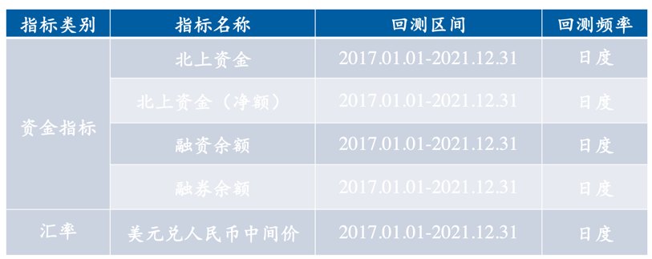
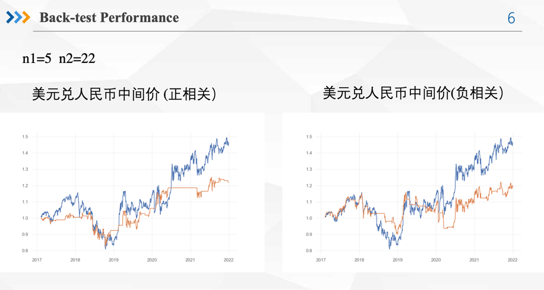
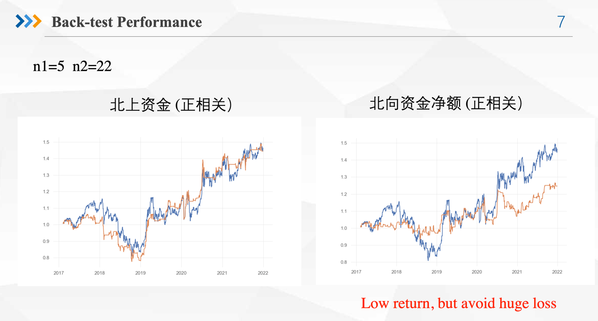
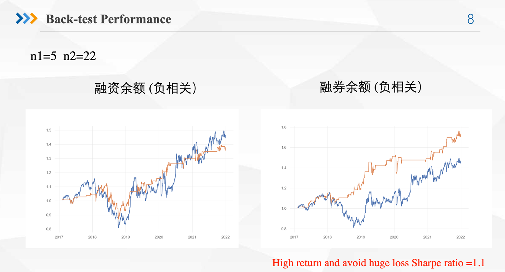
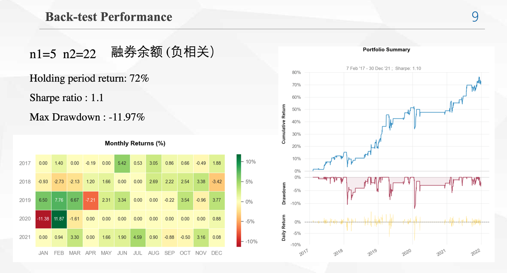
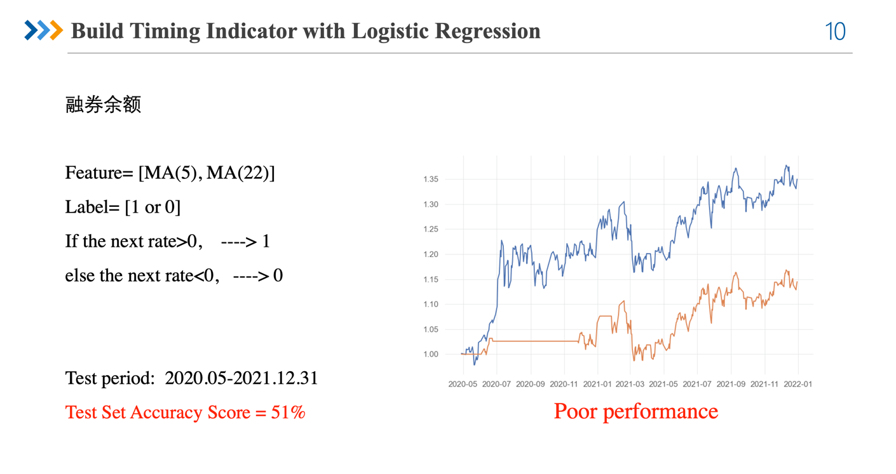

# algo-project-221040114—part

# Macro Timing Strategy

Step1: Obtain the factor sequence and the yield sequence;

Step2: For the factor series, do moving average calculation to remove the influence of obvious environmental changes on the factor value;

Among them, MA(n1) represents the recent moving average of the factor, and MA(n2) represents the long-term moving average of the factor

Step3: According to the correlation, if it is a positive correlation, then if k_factor > 1, that is, there is an upward trend in the near future, and the next position is set to 1. 
if k_factor < 1, that is, there is a recent downward trend, and the next position is set to 0; if it is negative correlation,
If k_factor > 1, the position in the next period is set to 0. If k_factor < 1, the position in the next period is set to 1; 

Step4: Draw the original yield curve and the yield curve after position control, and compare and test the validity.

# Factor description

# Back-test performance

Trough Logistic Regression, try to build a timing indicator with 融券余额.

However, it got a poor performance in test set. So, it may be good enough to directly use the MA ratio.
